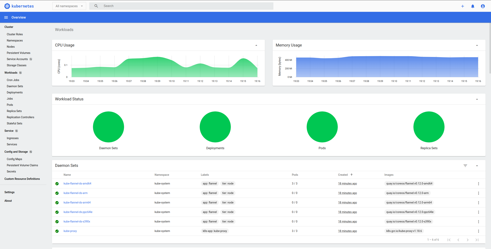

# kubernetes-localhost
Deploys Kubernetes with dashboard on local machine using Vagrant.

By default you get 1 master, 2 working nodes, and deployed dashboard.

Version of deployed Kubernetes cluster is 1.18, version of Ubuntu VirtualBox
image is 18.04.

Dashboard is available via NodePort on one of the deployed worker nodes.
If you didn't change network ip range in Vagrantfile, dashboard will be available
on either:
- https://192.168.100.101:30000

or
- https://192.168.100.102:30000




Note:
In order to access dashboard via Chromium based browsers, you'll have to bypass
invalid error certificate error on above mentioned URLs. In order to do that,
just type `thisisunsafe` while on dashboard page. You don't need any input
field, just typing it while on that page will do the trick.

## Requirements
* [Vagrant](https://www.vagrantup.com/)
* [VirtualBox](https://www.virtualbox.org/)

Note:
Vagrantfile uses ansible_local module, which means you don't need Ansible
installed on your workstation. However, if you already have it installed,
and prefer to use that instead of letting Vagrant install Ansible on each
node separately, change `*vm.provision` from `ansible_local` to `ansible` in
Vagrantfile.

Another option is having dedicated "controller" node, which can be used as
Ansible host. You can learn more by visiting this [link](https://www.vagrantup.com/docs/provisioning/ansible_local.html#ansible-parallel-execution-from-a-guest).

## How-To Manual

#### New setup:
* Clone this repository
* Run `vagrant up`

#### Poweroff machines:
* Run `vagrant halt`

#### Checking nodes status:
* Run `vagrant status`

#### Accessing master/worker nodes:
* While in project directory, type:
```shell
vagrant ssh $NAME_OF_THE_NODE
```
Example:
```shell
vagrant ssh k8s-master
```

#### Using kubectl from local workstation without SSH-ing via Vagrant
* Create dedicated config directory in local `.kube` directory
```bash
# Create directory in which you're going to store Kubernetes config
mkdir -p ~/.kube/kubernetes-localhost
# Copy file from Kubernetes master
scp -i ~/.vagrant.d/insecure_private_key vagrant@192.168.100.100:~/.kube/config ~/.kube/kubernetes-localhost
```
* You can now access Kubernetes cluster without sshing into Vagrant box:

`kubectl --kubeconfig=/home/$USER/.kube/kubernetes-localhost get pods --all-namespaces`

Optional:
Create alias in configuration file of your shell, for example:
```bash
# Open rc file
vim ~/.zshrc
# Insert alias
alias kubectl_local='kubectl --kubeconfig=/home/$USER/.kube/kubernetes-localhost'
# Save and exit Vim (can't help you there), and reload config
source ~/.zshrc
# Test
kubectl_local get pods --all-namespaces
```

#### Obtaining token for Dashboard access
* Check for secret name
```bash
kubectl get secrets -n kube-system | grep 'dashboard'
# Example:
kubectl describe secret/dashboard-access-token-mb7fw -n kube-system
```
* Navigate to one of above mentioned URLs and paste it in there

#### Delete setup:
* Run `vagrant destroy -f`
* Remove repository

